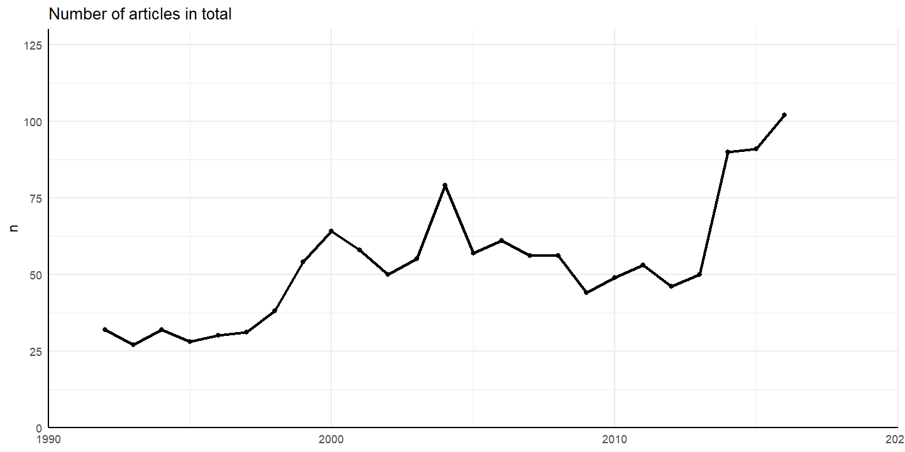
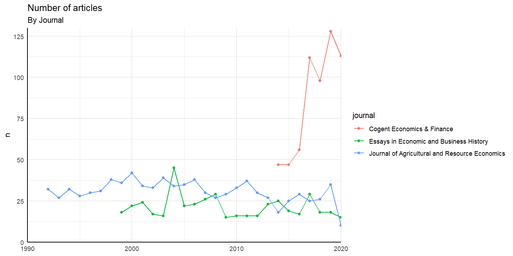
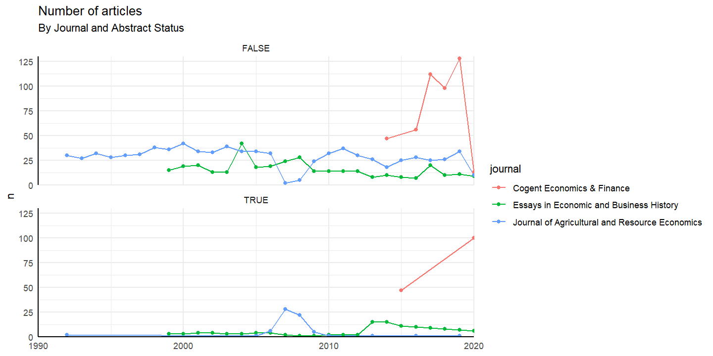
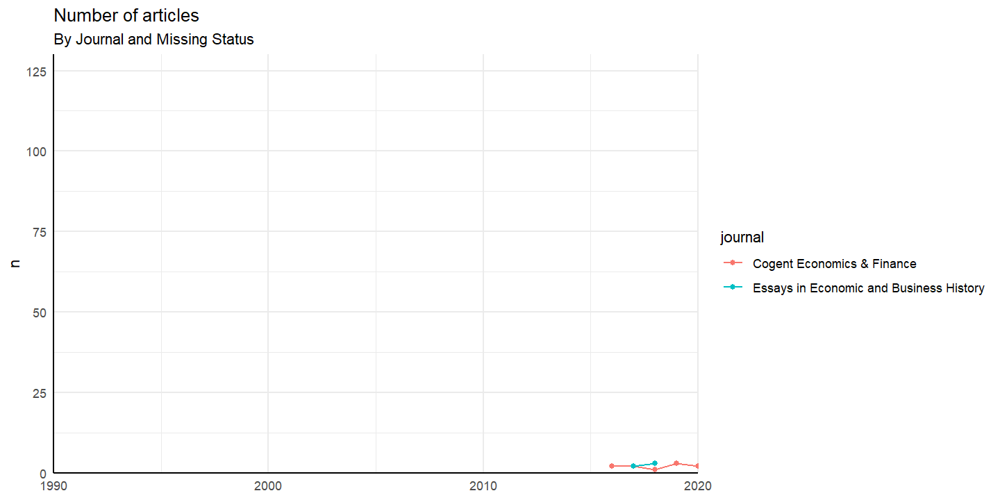
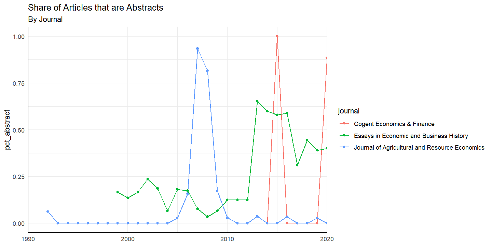
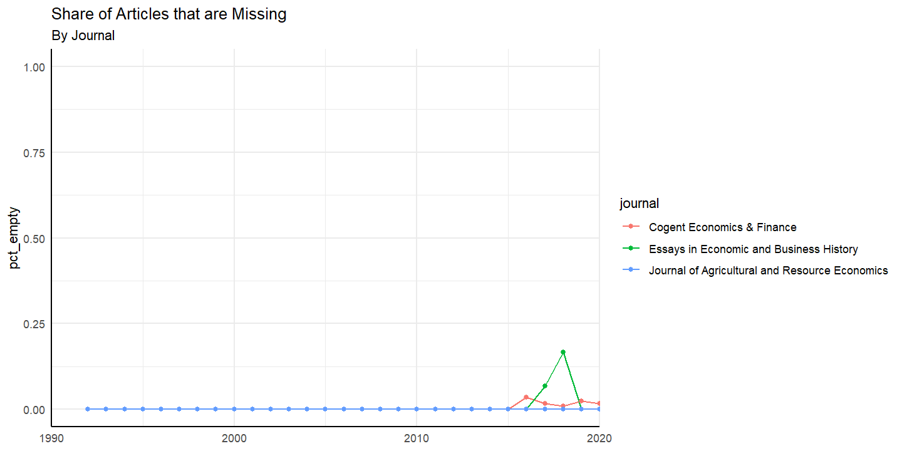
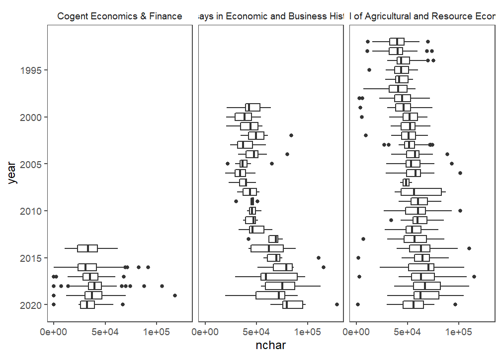

Economic Journals
================
Charlie Gallagher
12/4/2020

  - [Introduction](#introduction)
  - [Methods](#methods)
      - [Data Dictionary](#data-dictionary)
      - [Regular Expressions](#regular-expressions)
      - [Data Quality](#data-quality)
          - [Data completeness](#data-completeness)
          - [Article length over time](#article-length-over-time)

In this project, I explore trends in economics through text mining three
open academic journals.

Programs:

Python (3.8)

R (4.0.2)

# Introduction

This project was inspired by [Currie, Kleven, and
Zwiers](http://www.nber.org/papers/w26715), NBER Working Paper
No. 26715, “Technology and Big Data are Changing Economics: Mining Text
to Track Methods.” In that paper, Currie, Kleven, and Zwiers analyze a
large selection of applied microeconomic papers published as working
papers with NBER or in one of the top five journals (American Economic
Review, Econometrica, the Journal of Political Economy, the Quarterly
Journal of Economic, and the Review of Economic Studies). I use similar
methods to extend their analysis with three open economics journals
whose archives range back to 1992.

I chose three journals, which are as follows:

**Journal of Agricultural and Resource Economics** JARE. Statement:

> The Journal of Agricultural and Resource Economics publishes creative
> and scholarly economic studies in agriculture, natural resources, and
> related areas. Manuscripts dealing with the economics of food and
> agriculture, natural resources and the environment, human resources,
> and rural development issues are especially encouraged. JARE provides
> a forum for topics of interest to those performing economic research
> as well as to those involved with economic policy and education.
> Submission of comments on articles previously published in JARE is
> welcomed.

**Essays in Economic and Business History** EEBH. Statement:

> First published in 1976, annually since 1983, and currently in its
> 39th year of publication, Essays in Economic & Business History now
> operates as an on-line open access journal. Articles for the journal
> are selected by double blind review process. EEBH provides immediate
> open access to its content on the principle that making research
> freely available to the public supports a greater global exchange of
> knowledge. In this same spirit, accepted articles awaiting the next
> print issue are made available on-line as soon as the editorial
> process is completed.
> 
> While Economic History and Business History are two distinct
> disciplines, their similarities are stronger than their differences.
> Since 1975 the Economic & Business History Society has brought
> scholars from these two fields together through its annual meetings
> and through the society’s journal, Essays in Economic & Business
> History. EEBH aims to publish high-quality research from all areas of
> economic and business history, including articles in related
> disciplines such as financial, labor, management, organizational, and
> social history. We welcome both empirical and non-empirical research,
> as well as pieces that, despite their high level of scholarship, may
> not fit nicely into the usual boxes valued by other outlets in
> economic or business history. We welcome submissions from scholars at
> all career stages.

**Cogent Economics & Finance** CEF. Statement:

> Cogent Economics & Finance, part of Taylor & Francis / Routledge, is a
> multidisciplinary open access journal publishing high-quality
> peer-reviewed research by authors from across the globe. Our inclusive
> nature ensures we cover the entire scope of economics and finance
> research – from financial economics to economic philosophy and
> everything in between, including replication studies – and we make
> sure this research is visible to everyone, anywhere, any time. Cogent
> Economics & Finance is headed up by an expert team of Senior Editors
> who, in keeping with our vision of inclusivity and sharing, evaluate
> submissions on scholarly merit and research integrity. Manuscripts are
> never rejected purely on the grounds of perceived importance or impact
> on the research community; article-level metrics allow the research to
> be assessed on its own merit.

The journals were chosen based on their content, how many articles they
made available, and their presence in the database of the [Directory of
Open Access Journals](https://doaj.org/).

# Methods

The data was gathered and converted to a CSV with Python. Depending on
the journal, I either downloaded all articles and scraped the text from
them or downloaded the plain text directly from the journal website. I
queried each article with a simple set of regular expressions about key
phrases and methods. At the current stage, these expressions are fairly
simple and non-systematic. As the scope and direction of this project
develop, these will change.

Once the regular expression results are generated, they are converted to
a CSV containing one entry for each article.

### Data Dictionary

| Variable     | Meaning                                                              |
| ------------ | -------------------------------------------------------------------- |
| journal      | Academic Journal                                                     |
| title        | Article title                                                        |
| year         | Article publication year                                             |
| nchar        | Number of characters in article                                      |
| is\_empty    | Article has no searchable text                                       |
| is\_abstract | Article has no full-text; abstract searched                          |
| r\_kwd       | Number of times the regular expression `kwd` matched in the article. |

### Regular Expressions

| Variable         | Regular expression |
| ---------------- | ------------------ |
| To be completed… |                    |

## Data Quality

The data is of course not perfect. Some files could not be found with
regular URL searches; some files were downloaded but did not convert to
text. Each file was checked for length, the shortest often being corrupt
(0-10 characters). In general, most files that contained any characters
were the result of a successful conversion.

When a file was not found or converted properly, its full-text attribute
was filled instead with the abstract found in the DOAJ database. This
lets one search at least *part* of the content for keywords. There is a
flag `is_abstract` so you can filter these out for most analyses. When
the abstract could not be found, a blank string was used.

### Data completeness

<!-- --><!-- --><!-- --><!-- --><!-- --><!-- -->

**Notable Features**

1.  The number of articles per year is not always consistent over time.
2.  The years 2008 and 2009 are nearly completely missing for the JARE.
3.  The year 2014 is completely missing, and the year 2020 is almost
    completely missing, for Cogent Economics and Finance.
4.  Nearly every missing article was successfully replaced with an
    abstract, barring some in 2018 through 2020.
5.  The articles for EEBH are very incomplete after 2012.

### Article length over time

<!-- -->

-----

Charlie Gallagher | twitter: @charliegallaghr
